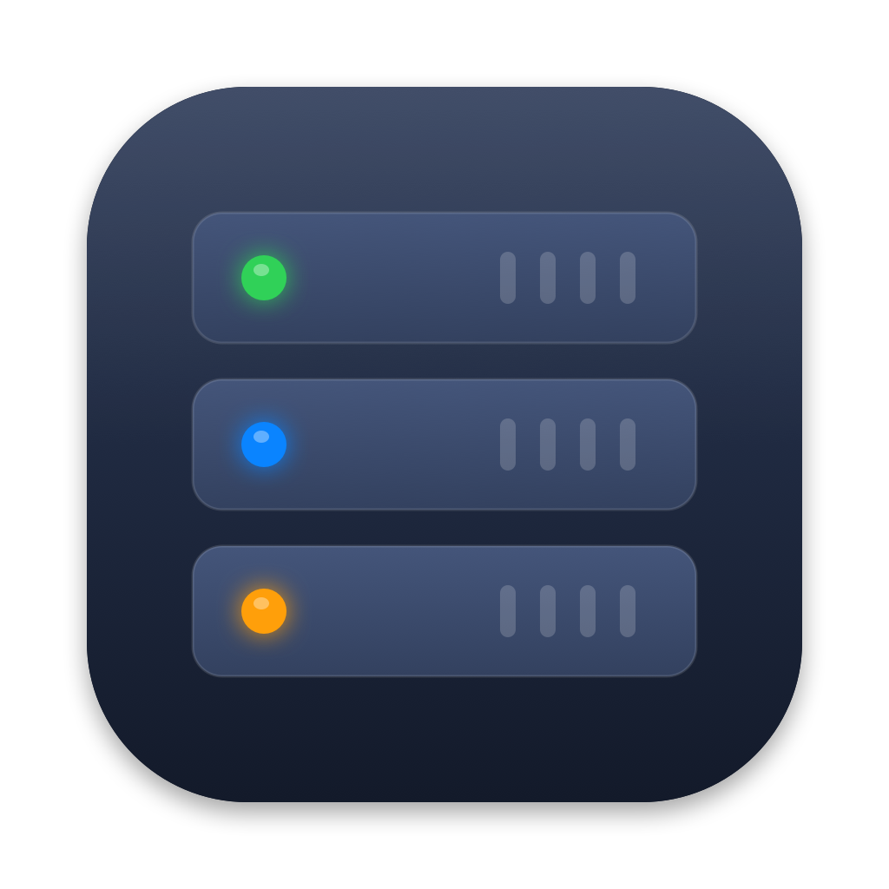
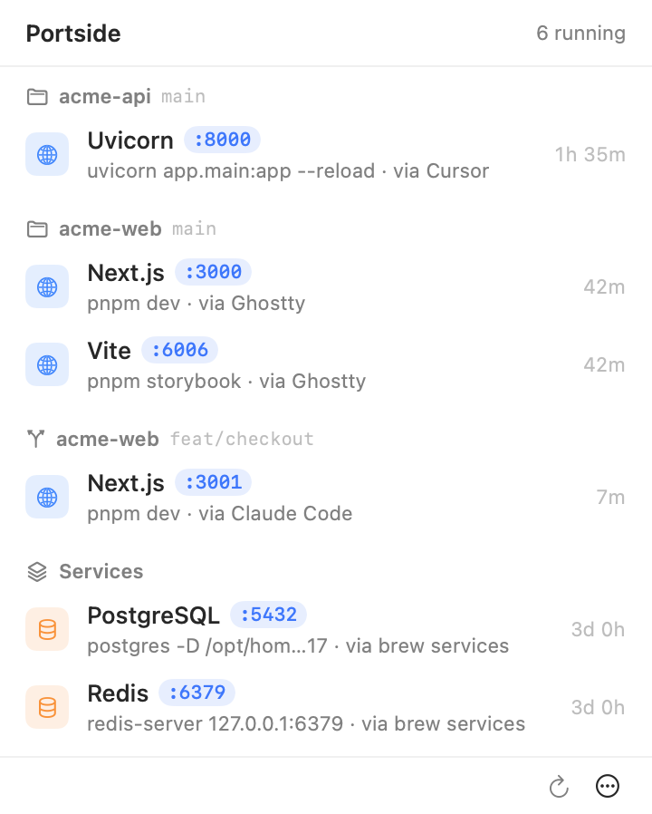

<div align="center">



# Portside

**Every dev server and local service on your Mac, in one menu bar click.**

See what's running, where it came from and which port it's on, then stop it.

[](https://github.com/guneysol/portside/actions/workflows/build.yml)


[](LICENSE)

<picture>
  <source media="(prefers-color-scheme: dark)" srcset="docs/screenshot-dark.png">
  
</picture>

</div>

## Install

```bash
curl -fsSL https://raw.githubusercontent.com/guneysol/portside/main/install.sh | bash
```

This builds from source in about 30 seconds and installs to `~/Applications`. Look for the icon in your
menu bar, then turn on **Launch at Login** from the `⋯` menu.

**Requires** macOS 14 or later, plus Apple's developer tools. If you don't have the tools, run
`xcode-select --install` and the installer will tell you. Because Portside is built on your
machine, Gatekeeper doesn't block it.

## Why

Five terminal tabs, two worktrees and an AI agent that started a server twenty minutes ago: soon
nobody knows what's holding port 3000. `lsof -i` answers with PIDs, and Activity Monitor shows a
dozen processes all called `node`. Portside tells you **what** each one is, **which project** it
belongs to, **who started it** and **what port** it's on, and stops it cleanly.

## Features

- **Finds every TCP listener.** Nothing needs configuring. It recognizes 70+ tools by name
  (Next.js, Vite, Rails, Django, Uvicorn, Postgres, Redis, Docker, Ollama…), and anything else
  still shows up.
- **Groups by project.** Rows are grouped by git repository. **Worktrees** appear separately
  with their branch, so parallel agents stay easy to tell apart.
- **Shows who started it:** Claude Code, Codex, Cursor, Ghostty, Terminal, `brew services`…
- **Stops it cleanly.** Stop takes down the whole `npm → sh → node` chain, with no orphans left
  holding the port, and never touches servers running next to it. Brew services go through
  `brew services stop` so they don't come back.
- **Flags exposed ports.** An orange mark shows a port that other devices on your network can reach.
- **Stays light.** It reads process and socket data directly from macOS and never spawns
  `lsof` or `ps`. [Numbers below.](#performance)

## Usage

| | |
|---|---|
| **Click a blue port** | Open `http://localhost:PORT` in your browser |
| **Click a gray port** (databases, services) | Copy `localhost:PORT` |
| **Hover a row** | Show the stop button |
| **Right-click a row** | Open or copy each port, Reveal in Finder, Copy Path, Command or PID, Stop, Force Quit |
| **Stop All** (footer) | Stop everything you own in the list, after one confirm (<kbd>Esc</kbd> cancels) |
| **`⋯` menu** | Show System & App Listeners, Launch at Login, Refresh (<kbd>⌘</kbd><kbd>R</kbd>), Quit (<kbd>⌘</kbd><kbd>Q</kbd>) |

The menu bar icon shows how many things are running. A row marked with a lock belongs to another
user, such as root. You can see it, but stopping it needs `sudo`.

## Performance

Measured on an Apple Silicon Mac:

| | |
|---|---|
| One scan | ~1.5 ms |
| Idle CPU | ~0.06% of one core |
| Memory | ~17 MB (≈35 MB after the menu has been opened) |
| Network | None. Nothing leaves your Mac |

It scans every 2 seconds while the menu is open. While it's closed, it scans every 10 seconds,
only to update the count, and lets macOS batch those wakeups to save energy. Scans that find no
change cause no redraw.

## FAQ

<details>
<summary><b>Why doesn't something show up?</b></summary>

Portside lists processes that **listen on a TCP port**. Things that never open one don't appear:
file watchers (`tsc --watch`, `jest --watch`), queue workers, idle AI agent sessions, and services
that only use unix sockets or UDP. Docker containers appear as one **Docker** row with every
published port, not one row per container. Root-owned listeners only appear while the menu is
open and **Show System & App Listeners** is on.
</details>

<details>
<summary><b>Does it need permissions, sudo or network access?</b></summary>

No. It asks for no accessibility or screen recording permission, never runs anything as root, and
makes no network connections. It only signals processes you own.
</details>

<details>
<summary><b>I stopped something and it came back.</b></summary>

Some tool manages it and restarts it, for example a launchd job with `KeepAlive`, a `docker
compose` restart policy or a process manager like `pm2`. Stop it through that tool. Brew services
are already handled.
</details>

<details>
<summary><b>A tool shows the wrong name, or just "Node".</b></summary>

Names come from a small table in [`Classifier.swift`](Sources/Portside/Classifier.swift). Adding a
tool takes one line, and a PR is very welcome.
</details>

<details>
<summary><b>Why is there no downloadable app or Homebrew cask?</b></summary>

A downloaded app has to be notarized by Apple, or Gatekeeper blocks it. Building from source avoids
that, and the whole app is about 1,300 lines of Swift, easy to read before you run it. A notarized
release is on the table if enough people want one.
</details>

## Update and uninstall

To update, run the install command again.

To uninstall, turn off **Launch at Login** in the `⋯` menu, quit Portside, then:

```bash
rm -rf ~/Applications/Portside.app
defaults delete io.github.guneysol.portside 2>/dev/null
```

## Contributing

Bug reports, tool names and PRs are welcome. [`CONTRIBUTING.md`](CONTRIBUTING.md) covers the
development loop, a mock environment that starts realistic fake servers, and the debug flags.

## License

[MIT](LICENSE)
